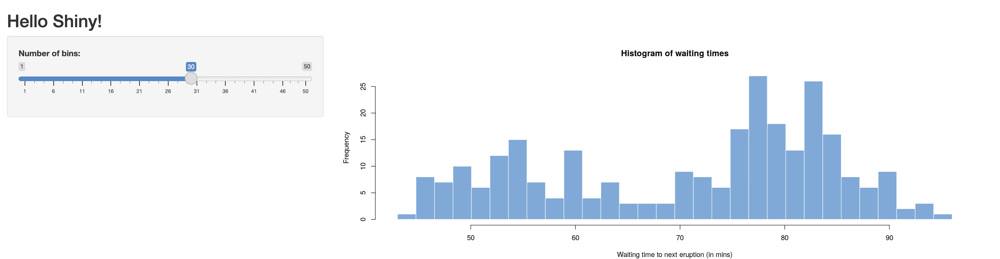

# Appsilon-Task-CICD-Containers

## Description

 Hello World R Shiny app application running on Docker.
 


## Getting Started

### Prerequisites

- Docker installed. See [Docker's official installation guide](https://docs.docker.com/get-docker/).

### Building the Docker Image

To build the Docker image locally, run the following command:

   ```bash
   docker build -t appsilon-r-hello .
   ```


### Running the Docker Image

After building the image, you can run it with:

```bash
docker run --rm -p 3838:3838 appsilon-r-hello
```

This command will start a container on port 3838. You should be able to access the application on http://localhost:3838

### Running the CICD Pipeline locally

We will you use [Act](https://nektosact.com/installation/index.html) to run the github-actions pipeline locally.


You wil need a **.secret file**: You need a file `.secret` that contains the Docker HUB credentials. The file should be in the format:

  ```
DOCKERHUB_USERNAME=test_username
DOCKERHUB_TOKEN=test_token
  ```

Command to run the pipeline

```bash
act --container-architecture linux/amd64
```


